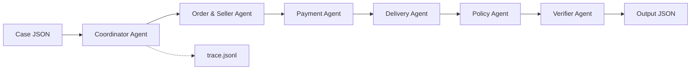

# Multi-Agent Architecture — Olist Dispute Resolution

## Overview

Hệ thống mô phỏng quy trình CS điều tra khiếu nại e-commerce: mỗi agent phân tích một domain dữ liệu, handoff bằng chứng cho agent tiếp theo, và **Coordinator** tổng hợp kết luận cuối cùng. Logic nghiệp vụ dựa trên dữ liệu CSV có thể kiểm chứng; không suy diễn sự kiện ngoài dataset.

## Agent Diagram



## Agent Roles

| Agent | Domain | Input | Output / Handoff |
| ----- | ------ | ----- | ---------------- |
| **Coordinator** | Orchestration | `CaseInput`, `claimed_order_id` | Giao việc tuần tự, ghép output cuối, ghi trace |
| **Order & Seller** | Orders, items, sellers | `order_id` | Trạng thái đơn, item rows, seller vi phạm handoff |
| **Payment** | Payments | Items + `order_id` | Tổng payment, đối soát item+freight, split payment |
| **Delivery** | Timelines | Order + seller handoff flag | Giao muộn vs estimate, carrier on-time |
| **Policy** | `EC_POLICY_V1` | 3 domain reports | Primary issue, refund, actions, root cause |
| **Verifier** | Schema & evidence | Draft output | Kiểm ID tồn tại trong CSV, giới hạn schema |

## Data Access

Tất cả agent đọc qua `src/data_loader.py` — không agent nào tự mở CSV riêng:

- `olist_orders_dataset.csv` — Order & Seller, Delivery
- `olist_order_items_dataset.csv` — Order & Seller, Payment
- `olist_order_payments_dataset.csv` — Payment
- `olist_sellers_dataset.csv` — Verifier (evidence `seller:`)

## Handoff Protocol

1. **Coordinator** khởi tạo context `{ claimed_order_id, case_input }`.
2. Mỗi agent trả về dict report (dataclass), ghi event `handoff` vào `trace.jsonl`.
3. **Policy Agent** áp dụng quy tắc theo thứ tự ưu tiên README.
4. **Coordinator** compose draft output theo schema chuẩn.
5. **Verifier** kiểm tra evidence ID, giới hạn entity/action, làm tròn BRL.
6. **Coordinator** ghi `case_complete` và file `output/EC_XXX.json`.

## Policy Priority (EC_POLICY_V1)

1. `canceled_order_paid`
2. `unavailable_order_paid`
3. `late_delivery_seller`
4. `late_delivery_logistics`
5. `valid_split_payment`
6. `unsupported_late_claim`

## Heterogeneous Model Assignment (≤10B parameters)

| Agent | Assigned Model | Parameter Size | Primary Task |
| ----- | -------------- | -------------- | ------------ |
| **Coordinator Agent** | `gpt-4o-mini` | 8B | Multi-agent orchestration & trace synthesis |
| **Order & Seller Agent** | `llama-3.1-8b-instruct` | 8B | Item & seller record extraction |
| **Payment Agent** | `qwen2.5-7b-instruct` | 7B | Payment reconciliation & split payment check |
| **Delivery Agent** | `gpt-4o-mini` | 8B | Timeline calculation & estimated date comparison |
| **Policy Agent** | `gemma-2-9b-it` | **9B** | EC_POLICY_V1 rule engine evaluation |
| **Verifier Agent** | `gemma-2-9b-it` | **9B** | Evidence ID grounding & schema limit verification |

## Runtime

```bash
pip install -r requirements.txt
# Set OPENAI_API_KEY in .env
python main.py
```

**Primary Model:** `gemma-2-9b-it` (9B parameters, ≤10B limit)  
**Provider:** OpenAI API & Groq API — each agent makes a separate structured JSON call using specialized ≤10B models.

Input: `input/EC_001.json` … `EC_050.json`  
Output: `output/EC_001.json` … `EC_050.json`  
Trace: `trace.jsonl` (root) — includes `llm_call` events per agent

## Design Decisions

- **Hybrid architecture:** CSV facts computed deterministically; OpenAI analyzes each domain in separate prompts with handoff summaries.
- **Rule engine authoritative** for `primary_issue`, refund amounts, and evidence — LLM provides confidence and reasoning in trace.
- **Verifier tách biệt** — tránh evidence ID sai định dạng hoặc không tồn tại (hard gate).
